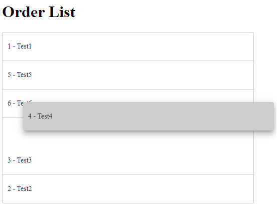
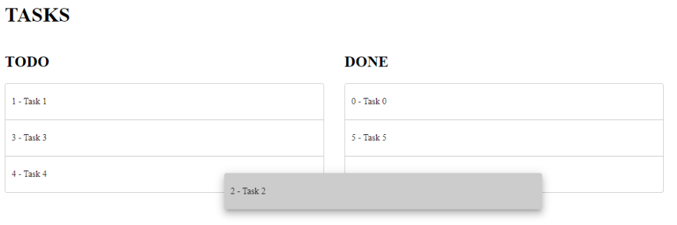

  

# drag-drop-view

  

This project provides some directives to help UI implementations with drag and drop.

  

## Installation

To install this package, run:
```bash
$ npm install drag-drop-view --save
```
  
and then from your Angular Aplication:

```typescript
import { BrowserModule } from  '@angular/platform-browser';
import { NgModule } from  '@angular/core';
import { AppComponent } from  './app.component';

// Import drag and drop view module
import { DragAndDropViewModule} from  'drag-drop-view';

@NgModule({
	declarations: [
		AppComponent
		],
	imports: [
		BrowserModule,
		// Add DragAndDropViewModule
		DragAndDropViewModule.forRoot()
		],
		providers: [],
		bootstrap: [AppComponent]
})
export  class AppModule { }
```

Once the modulo is imported, you can use directives to drag and drop your layout.
 

## Available directives

  

### DragAndDropChildrenDirective

This directive provides drag-and-drop functionality inside a html element.

#### How to use

Add directive to your element and pass your list to directive

```xml
<div drag-and-drop-children [list]="fields">
	<div *ngFor="let field of fields">
	{{field.name}}
	</div>
</div>
```

  

It's possible to ignore some children elements to don't allow drag and drop, for that you need:

```xml

<div drag-and-drop-children [list]="fields"  ignoreClass="ignore">
    <div *ngFor="let field of fields" [ngClass]="{'ignore': item.key == 2}">
    {{field.name}}
    </div>
</div>
```



### DragAndDropToDirective

This directive provides drag-and-drop between two html elements.


#### How to use

Add directive to your element and pass your list to directive

```xml
<div>
  <div class="edit-layout-list"
       [drag-and-drop-to]="connectTo"
       [list]="todoData"
       (change)="print($event)">

    <div class="edit-layout-box" *ngFor="let item of fieldsMulti1">
      {{item.key}} - {{item.name}}
    </div>
  </div>
  
  <div #done class="edit-layout-list" >
    <div class="edit-layout-box" *ngFor="let item of doneData">
      {{item.key}} - {{item.name}}
    </div>
  </div>
</div>
```

Typescript

```
  ...
  doneList: any[] = [{key:0, name:'Task 1: Build component'},
            {key:1, 'Task 1: Build directive to'}] 

  @ViewChild('done', { read: ViewContainerRef, static: false })
  public done: ViewContainerRef;

  private connectTo: DragAndDropConnectTo;

  ...
  this.connectTo = {
      data : this.doneList,
      viewElement : this.done
  }
  ...
```




## License

MIT © [# mfdiaspinto](mailto:mfdiaspinto@gmail.com )